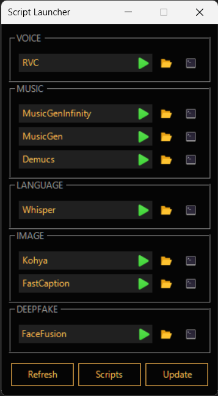

# QuickPSScriptLauncher
*A quick way to launch scripts, handy for your numerous cloned githubs if you use conda etc*

## Installation & Usage
1. Git clone this repo
2. Right click main.ps1 > run with powershell
3. A shortcut will be created at the root, use it to add the program to your taskbar if you want
4. Place your scripts in a subfolder **(not at the root)** of the "scripts" folder, they will then appear in the UI after you hit **Refresh**
5. Launch your scripts by clicking the `▶️` button, they should be launched in a new powershell window
6. browse to the execution `$location` of the script by clicking the `📂` button (see *Script Example* bellow)
7. launch a powershell windows in this execution `$location` by clicking the `PS` button (see *Script Example* bellow)
8. Click `Open Folder` to open the script library
9. Click `Update` to `git pull` this repository for updates (⚠️ ***experimental, only works if you git cloned this repo***) 


## Script example
*Using a github repo with conda env*
```ps
$location =  "path/to/repo" # It's important to set this variable, else the  📂 and PS buttons won't appear 
Set-location $location
conda activate envname
git pull # if you want to auto update
python app.py
```
## Current UI

